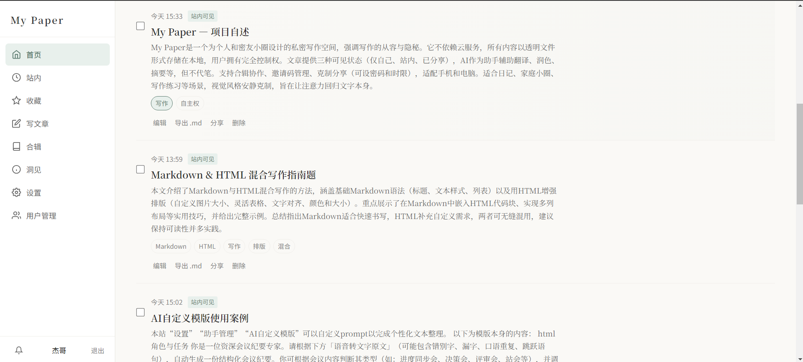
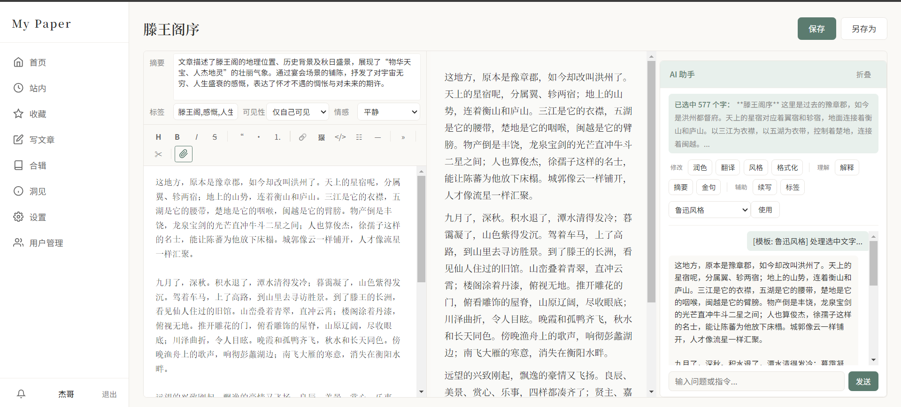
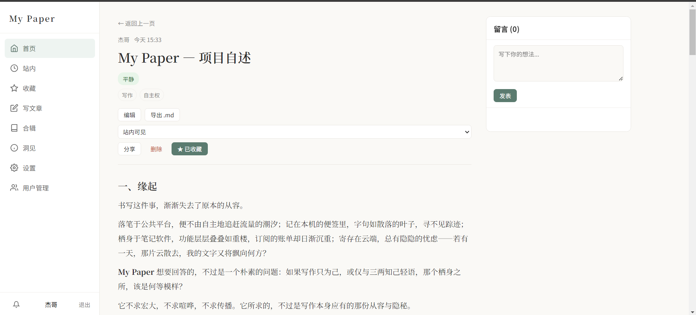
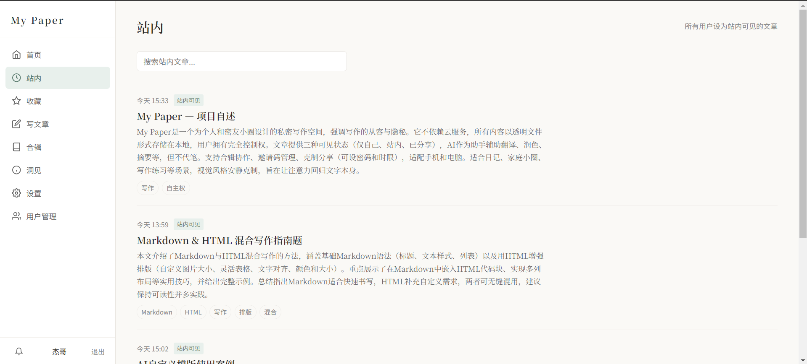
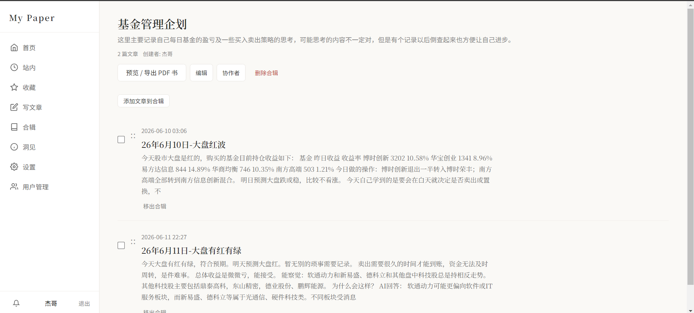
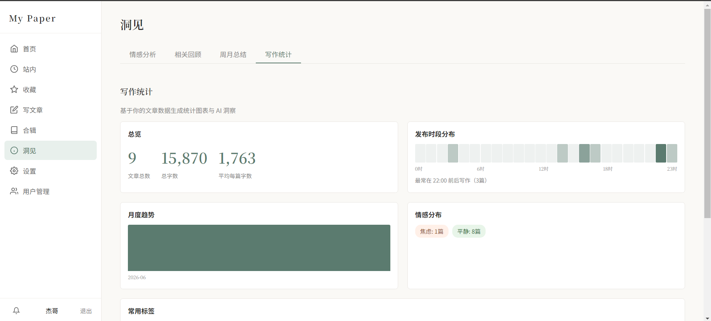
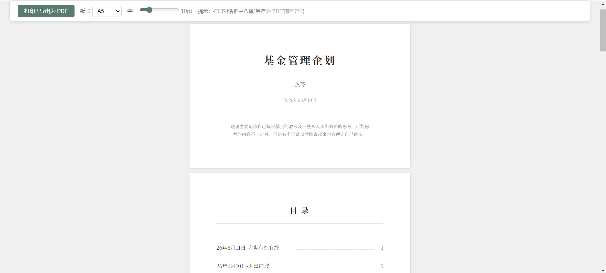
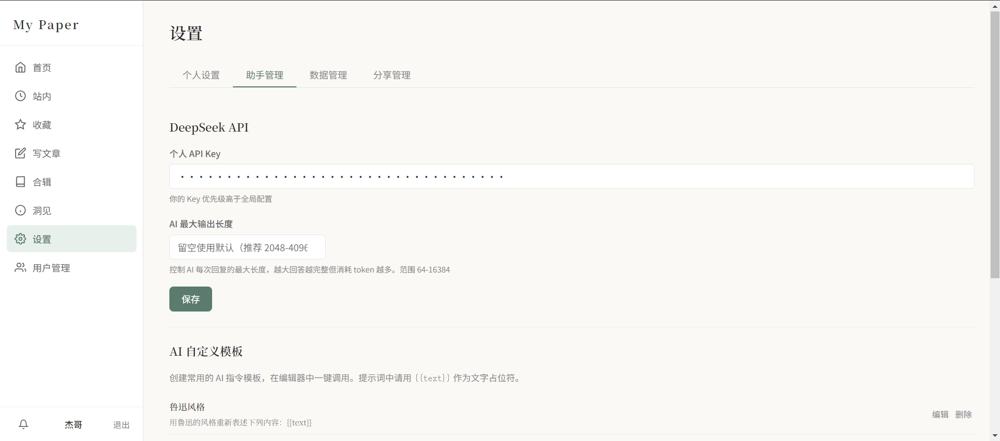
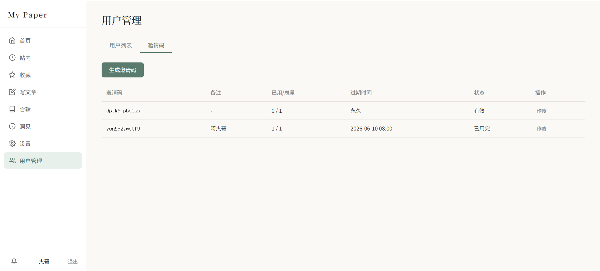

# My Paper

> [中文文档](README_CN.md)

A lightweight, self-hosted personal diary and writing platform. Flat-file storage, no database required.

## Features

- **Zero-database** — All data stored as JSON files, deploy anywhere with just PHP
- **Markdown Editor** — Three-panel editor with live preview and toolbar
- **AI Assistant** — DeepSeek-powered writing aid: polish, translate, explain, summarize, continue writing, and more
- **Article References** — Type `@` to search and link your own articles
- **Collections** — Group articles into shareable collections with collaborator support
- **Export** — Export articles or collections as Markdown/ZIP with embedded images
- **Sharing** — Generate shareable links with optional password protection
- **Insights** — AI-powered writing analytics: sentiment tracking, period summaries, writing patterns
- **Multi-user** — Invite-code based registration, admin user management
- **LaTeX Support** — Render math formulas with KaTeX
- **Image Tools** — Built-in image cropping, paste-to-upload, drag-and-drop upload
- **Drafts** — Server-side auto-save every 30 seconds
- **Mobile-friendly** — Responsive design with mobile tab switching

## Screenshots

### Home


### Editor


### Article


### Internal (Community)


### Collections


### Insights


### Export


### Settings


### User Management


## Requirements

- PHP 7.4 or higher
- PHP extensions: `json`, `mbstring`, `zip` (optional, for exports)
- Web server with URL rewriting (Apache mod\_rewrite or Nginx)
- [DeepSeek API key](https://platform.deepseek.com/) (optional, for AI features)

## Quick Start

1. Clone or copy the project to your web server directory:

```bash
git clone https://github.com/ZengVeijie/my-paper.git
```

2. Ensure the `data/` and `export/` directories are writable by the web server:

```bash
chmod -R 755 data export
```

3. Edit `config.php` to set your admin credentials and DeepSeek API key:

```php
define('DEFAULT_ADMIN_USERNAME', 'admin');
define('DEFAULT_ADMIN_PASSWORD', 'admin123'); // Change this!
define('DEEPSEEK_API_KEY', '');                // Optional
```

4. Configure your web server to route all requests to `index.php`.

### Apache

The project includes a `.htaccess`-style router. Make sure `mod_rewrite` is enabled and `AllowOverride All` is set.

### Nginx

```nginx
location / {
    try_files $uri $uri/ /index.php?$query_string;
}
```

5. Open your site and log in with the admin credentials. The admin user is created automatically on first access.

## Subdirectory Deployment

To deploy under a subdirectory (e.g., `https://example.com/mypaper/`), no configuration is needed — the app auto-detects its base path from `SCRIPT_NAME`.

## Project Structure

```
mypaper/
├── config.php          # Site configuration
├── index.php           # Entry point & router
├── router.php          # Route definitions
├── lib/                # Backend logic
│   ├── ai.php          # DeepSeek AI integration
│   ├── articles.php    # Article CRUD
│   ├── auth.php        # Authentication & users
│   ├── backup.php      # Export & sharing
│   ├── helpers.php     # Utility functions
│   ├── notifications.php
│   └── router.php      # Router class
├── themes/             # PHP view templates
├── public/             # Static assets
│   ├── css/
│   └── js/
├── data/               # JSON data storage (auto-created)
│   ├── articles/
│   ├── users/
│   ├── collections/
│   ├── uploads/
│   └── ...
└── export/             # Generated export files
```

## License

MIT
